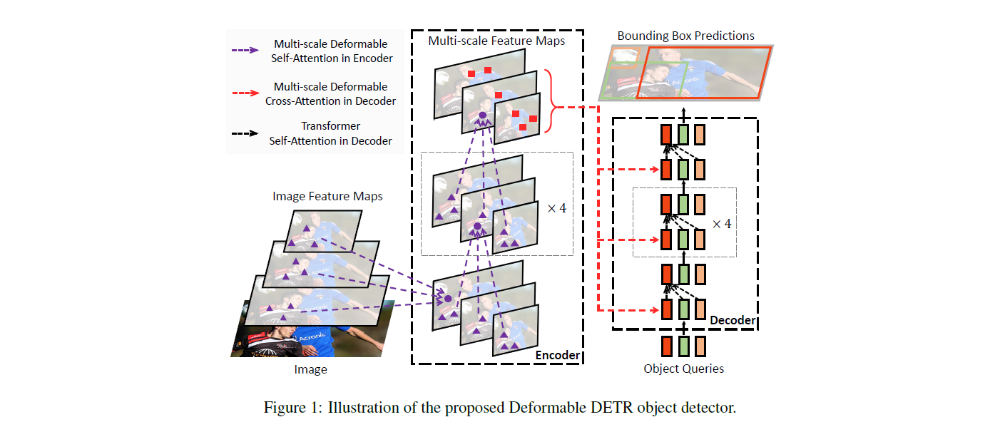

# UniPoly

Official implementation of **UniPoly: A Unified Instance-Level Framework for Polygon and Polyline Extraction from Remote Sensing Images**.

UniPoly formulates building polygon extraction and road/boundary polyline extraction in a unified instance-level framework. The repository contains the model, dataset loaders, training scripts, evaluation routines, and experiment configurations used for the three benchmark settings in the paper.



## Highlights

- Unified instance-level extraction framework for both polygons and polylines.
- End-to-end Transformer-based architecture built on Deformable DETR.
- Dataset-specific training and evaluation entry points for CrowdAI, SpaceNet3, and TopoBoundary.
- COCO-style annotation interface with instance point sequences stored in `segmentation`.
- Integrated evaluation pipelines for building polygon quality and road/boundary topology metrics.

## Repository Structure

```text
UniPoly/
├── configs/                    # Dataset-specific launch scripts
│   ├── crowdai.sh
│   ├── spacenet3.sh
│   └── topoboundary.sh
├── datasets/                   # Dataset readers, transforms, and evaluation helpers
├── models/                     # UniPoly model and Deformable Attention CUDA operator
│   └── ops/                    # Multi-scale deformable attention extension
├── train/                      # Main training/evaluation entry points
│   ├── main_crowdai.py
│   ├── main_spacenet3.py
│   └── main_topoboundary.py
├── tools/                      # Distributed training launchers
├── util/                       # Common utilities
├── engine.py                   # Training and evaluation loops
├── environment.yml             # Reference conda environment
└── README.md
```

## Installation

### Requirements

The released environment was tested with:

- Linux
- NVIDIA GPU with CUDA 11.1
- Python 3.9
- PyTorch 1.9.1
- torchvision 0.10.1
- GCC compatible with the CUDA toolkit

Create the conda environment:

```bash
conda env create -f environment.yml
conda activate unipoly
```

If your CUDA/PyTorch version differs from the reference environment, install the matching PyTorch stack first, then install the remaining packages from `environment.yml`.

### Compile Deformable Attention

UniPoly uses the multi-scale deformable attention CUDA operator inherited from Deformable DETR. Compile it before training or evaluation:

```bash
cd models/ops
sh make.sh
python test.py
cd ../..
```

The unit test should report successful checks. If compilation fails, verify that `CUDA_HOME`, `nvcc`, PyTorch, and GCC are mutually compatible.

## Data Preparation

The code uses COCO-style JSON annotations. Each object annotation should contain at least:

- `image_id`
- `category_id`
- `bbox` in `[x, y, width, height]` format
- `area`
- `iscrowd`
- `segmentation`, where the first polygon/polyline is a flattened coordinate sequence:

```json
{
  "id": 1,
  "image_id": 1,
  "category_id": 1,
  "bbox": [x, y, w, h],
  "area": 1234.5,
  "iscrowd": 0,
  "segmentation": [[x1, y1, x2, y2, "..."]]
}
```

During training, UniPoly reads `segmentation[0]` as the instance-level ordered point sequence. The dataset-specific transforms then augment, crop, normalize, and resample these coordinates for polygon/polyline supervision.

### CrowdAI Buildings

Default entry:

- training script: `train/main_crowdai.py`
- dataset key: `crowdai_instance_pts_v2`
- default image root: `/irsa/build_data/CrowdAI/train/images`
- default training annotation: `../../json_v2/train_v1.json` relative to the image root
- default validation image root: `/irsa/build_data/CrowdAI/val/images`
- default validation annotation: `/irsa/build_data/CrowdAI/val/annotation_v2.json`

Recommended layout:

```text
CrowdAI/
├── train/
│   └── images/
├── val/
│   ├── images/
│   └── annotation_v2.json
└── json_v2/
    └── train_v1.json
```

### SpaceNet3 Roads

Default entry:

- training script: `train/main_spacenet3.py`
- dataset key: `road_instance_pts_v6`
- default image root: `/irsa/ROAD_DATA/sat2graph_sn3_dataset/RGB_1.0_meter`
- default training annotation: `/irsa/ROAD_DATA/sat2graph_sn3_dataset/json_v2/train_v18.json`
- default validation annotation: `/irsa/ROAD_DATA/sat2graph_sn3_dataset/json_v2/test_v17.json`

Recommended layout:

```text
sat2graph_sn3_dataset/
├── RGB_1.0_meter/
└── json_v2/
    ├── train_v18.json
    └── test_v17.json
```

### TopoBoundary

Default entry:

- training script: `train/main_topoboundary.py`
- dataset key: `topoboundary_instance_pts_v4`
- default dataset root: `/irsa/ROAD_DATA/topo_boundary/Topo-boundary/dataset`
- default training annotation: `json/roadboundary_train_v9.json`
- default validation annotation: `json/roadboundary_test_v9.json`

Recommended layout:

```text
Topo-boundary/
└── dataset/
    ├── images or image files expected by the COCO JSON
    └── json/
        ├── roadboundary_train_v9.json
        └── roadboundary_test_v9.json
```

## Training

The recommended way to reproduce experiments on a new machine is to call the dataset-specific Python entry point directly and explicitly pass `--coco_path` and `--output_dir`. The scripts in `configs/` preserve the paper's launch settings, but they contain machine-specific absolute Python paths and should be edited before use.

### Single-GPU Training

CrowdAI:

```bash
python -u train/main_crowdai.py \
  --batch_size 4 \
  --coco_path /path/to/CrowdAI/train/images \
  --output_dir /path/to/outputs/CrowdAI \
  --with_box_refine \
  --two_stage
```

SpaceNet3:

```bash
python -u train/main_spacenet3.py \
  --batch_size 1 \
  --coco_path /path/to/sat2graph_sn3_dataset/RGB_1.0_meter \
  --output_dir /path/to/outputs/SN3 \
  --with_box_refine \
  --two_stage
```

TopoBoundary:

```bash
python -u train/main_topoboundary.py \
  --batch_size 4 \
  --coco_path /path/to/Topo-boundary/dataset \
  --output_dir /path/to/outputs/TopoBoundary \
  --with_box_refine \
  --two_stage
```

### Distributed Training

Use the provided launcher for multi-GPU experiments after updating the corresponding config script paths. For example, training CrowdAI on 8 GPUs:

```bash
GPUS_PER_NODE=8 ./tools/run_dist_launch.sh 8 configs/crowdai.sh \
  --batch_size 4 \
  --coco_path /path/to/CrowdAI/train/images \
  --output_dir /path/to/outputs/CrowdAI
```

The same pattern applies to `configs/spacenet3.sh` and `configs/topoboundary.sh`.

### Main Hyperparameters

| Dataset | Entry | Epochs | Batch size | Instance queries | Points per instance | LR drop | Evaluator |
| --- | --- | ---: | ---: | ---: | ---: | ---: | --- |
| CrowdAI | `train/main_crowdai.py` | 100 | 4 | 35 | 64 | 20 | `evaluate_building` |
| SpaceNet3 | `train/main_spacenet3.py` | 500 | 1 | 80 | 64 | 40 | `evaluate_pixeleval` |
| TopoBoundary | `train/main_topoboundary.py` | 500 | 4 | 24 | 64 | 40 | `evaluate_aplsv2` |

Common defaults:

- optimizer: AdamW
- base learning rate: `2e-4`
- backbone learning rate: `2e-5`
- weight decay: `1e-4`
- backbone: ResNet-50
- encoder/decoder layers: 6/6
- hidden dimension: 256
- feature levels: 4
- seed: 42
- two-stage and iterative box refinement enabled

## Evaluation

### Evaluate CrowdAI Checkpoints

`main_crowdai.py` supports evaluation mode:

```bash
python -u train/main_crowdai.py \
  --eval \
  --resume /path/to/checkpoint.pth \
  --coco_path /path/to/CrowdAI/train/images \
  --output_dir /path/to/eval/CrowdAI
```

### Evaluate SpaceNet3 and TopoBoundary Checkpoints

The SpaceNet3 and TopoBoundary training scripts perform periodic evaluation during training. To evaluate a saved checkpoint in a standalone run, pass it through `--resume` and set the desired output directory:

```bash
python -u train/main_spacenet3.py \
  --resume /path/to/checkpoint.pth \
  --coco_path /path/to/sat2graph_sn3_dataset/RGB_1.0_meter \
  --output_dir /path/to/eval/SN3
```

```bash
python -u train/main_topoboundary.py \
  --resume /path/to/checkpoint.pth \
  --coco_path /path/to/Topo-boundary/dataset \
  --output_dir /path/to/eval/TopoBoundary
```

The evaluation routines write prediction files and metric artifacts under `output_dir`. For topology-oriented metrics, make sure the external metric toolkit paths referenced in `engine.py` are available in your environment.

## Released Results

Prediction results for the three datasets are available here:

- [Google Drive](https://drive.google.com/file/d/1K5rnZ6gMIF5tpSGe2JQfWA1QpBe-sIwv/view?usp=drive_link)
- [Baidu Netdisk](https://pan.baidu.com/s/14tZO2bkNPRifLlLTxNQviA?pwd=9gvp)

Use these files to verify post-processing, metric computation, or downstream analysis without retraining the model.

## Reproducibility Checklist

For faithful reproduction, please report:

- Git commit hash of this repository.
- CUDA, PyTorch, torchvision, and compiler versions.
- Dataset version, split files, and annotation conversion script if modified.
- Number and type of GPUs.
- Full command line for training and evaluation.
- Random seed. The default seed is `42`.
- Checkpoint used for evaluation.
- Whether `--cache_mode`, batch size, or dataset paths were changed.

Training is deterministic only up to the usual limits of CUDA kernels, distributed data loading, and GPU library implementations. Small metric variations can occur across hardware and software stacks.

## Citation

If this repository is useful for your research, please cite UniPoly:

```bibtex
@article{unipoly,
  title={UniPoly: A Unified Instance-Level Framework for Polygon and Polyline Extraction from Remote Sensing Images},
  author={},
  journal={},
  year={}
}
```

Please also consider citing Deformable DETR, on which the implementation is built:

```bibtex
@article{zhu2020deformable,
  title={Deformable DETR: Deformable Transformers for End-to-End Object Detection},
  author={Zhu, Xizhou and Su, Weijie and Lu, Lewei and Li, Bin and Wang, Xiaogang and Dai, Jifeng},
  journal={arXiv preprint arXiv:2010.04159},
  year={2020}
}
```

## License and Acknowledgement

This project is released under the Apache-2.0 license. Parts of the implementation are adapted from [Deformable DETR](https://github.com/fundamentalvision/Deformable-DETR) and [DETR](https://github.com/facebookresearch/detr). We thank the authors for their excellent open-source code.

## Important Note on Absolute Paths

Some scripts currently contain machine-specific absolute paths, including dataset roots, output directories, Python import paths, and external metric toolkit paths. These paths are intentionally documented above but not changed in code. Before running the repository on another machine, please update the corresponding paths in `configs/*.sh`, `train/*.py`, `datasets/*.py`, and the metric-related sections of `engine.py` to match your local environment.
